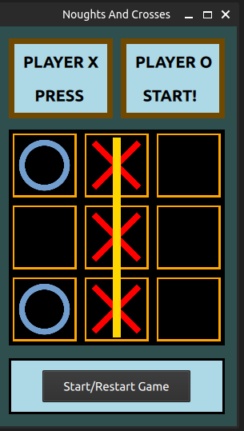


❌⭕ Noughts and Crosses — Qt / QML

A classic Tic-Tac-Toe (Noughts and Crosses) game implemented using Qt Quick (QML) with a C++ backend.
This is the very first project I ever wrote in Qt, created at the beginning of my Qt/QML learning journey.

🎮 Gameplay Overview
    • Two-player local game (X vs O)
    • Players take turns clicking on the board
    • The game detects:
        ◦ winning lines (rows, columns, diagonals)
        ◦ draw conditions
    • A visual line highlights the winning combination
    • Game can be restarted at any time
Controls
    • 🖱️ Mouse click — Place X or O
    • ▶️ Start / Restart button — Reset the game

🧩 Main Components
QML UI
    • Game window layout and styling
    • Board rendering using Repeater
    • Mouse interaction handling (MouseArea)
    • Player turn indicators and win/draw messages
    • Visual win-line overlays
JavaScript Helpers
    • UI state helpers (turn indicators, line visibility)
    • Board and UI reset logic
    • Visual state synchronization between components
C++ Backend (Game Logic)
    • Game board representation using QVector<int>
    • Turn handling and move validation
    • Win condition detection
    • Draw detection (no moves left)
    • Exposed properties via Q_PROPERTY for QML integration
    • Custom signals for UI updates
C++ Entry Point
    • Minimal Qt application bootstrap
    • Loads QML via QQmlApplicationEngine
    • Registers backend class for use in QML

🛠️ Technologies
    • Qt 5 / Qt Quick
    • QML
    • C++ (QObject-based backend)
    • JavaScript (UI helpers)
    • Qt Resource System (QRC)
    • CMake

⚠️ Project Status — First Qt Learning Project (MVP)
This project is a finished MVP and is not under active development.
    • Created as my first-ever Qt project
    • Written before learning advanced Qt/QML patterns
    • Implemented without AI assistance
    • Architecture reflects a very early learning stage
Known limitations (intentional at the time):
    • No AI opponent
    • No architecture patterns like MVVM
    • Tight coupling between some UI and logic parts
Despite this, the project demonstrates:
    • Successful QML ↔ C++ integration
    • Understanding of Qt properties, signals, and slots
    • Non-trivial game logic implemented in C++
    • Ability to complete a full, playable application

📌 About This Repository
This repository is kept public as a personal milestone — documenting the very beginning of my Qt development journey.
It serves as:
    • a reference point for long-term progress,
    • proof of early understanding of Qt fundamentals,
    • and a comparison baseline for later, more advanced projects.
I intentionally keep this project unchanged to preserve its educational and historical value.

